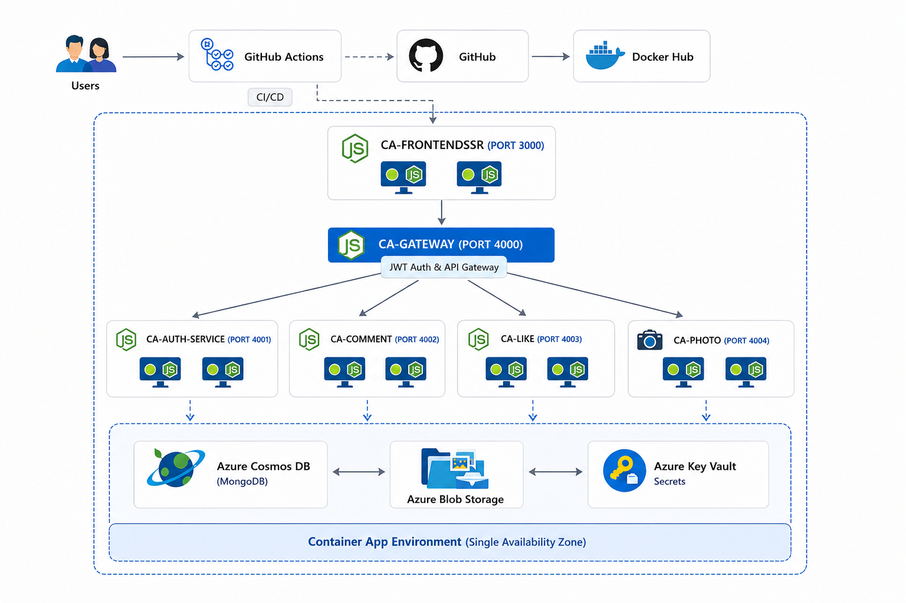
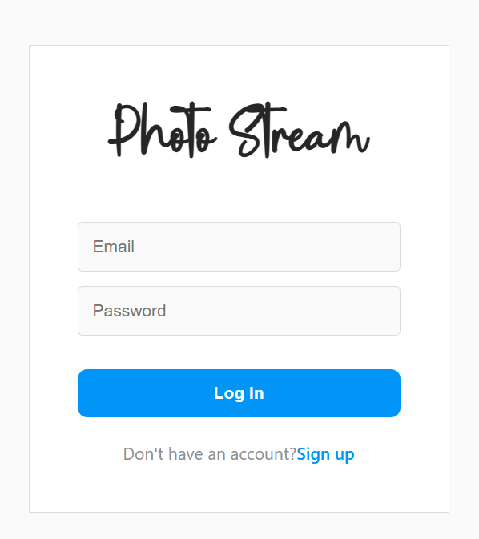
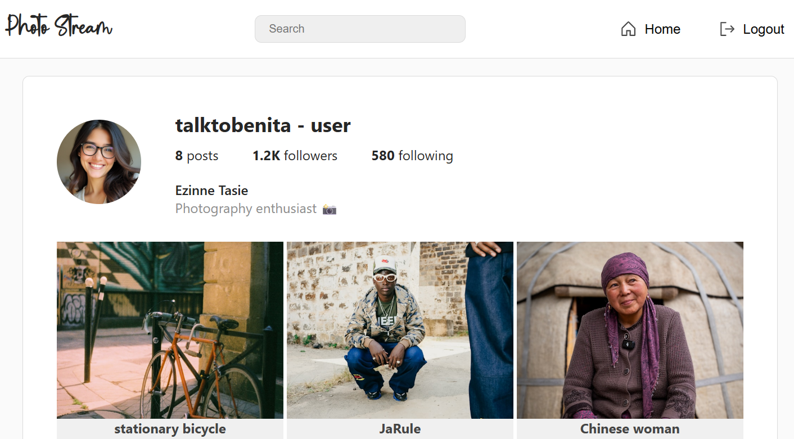
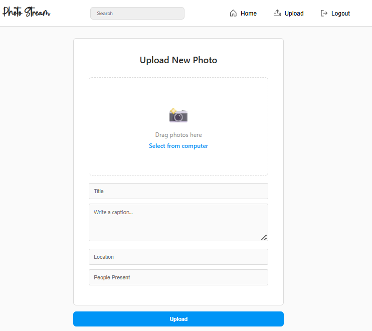
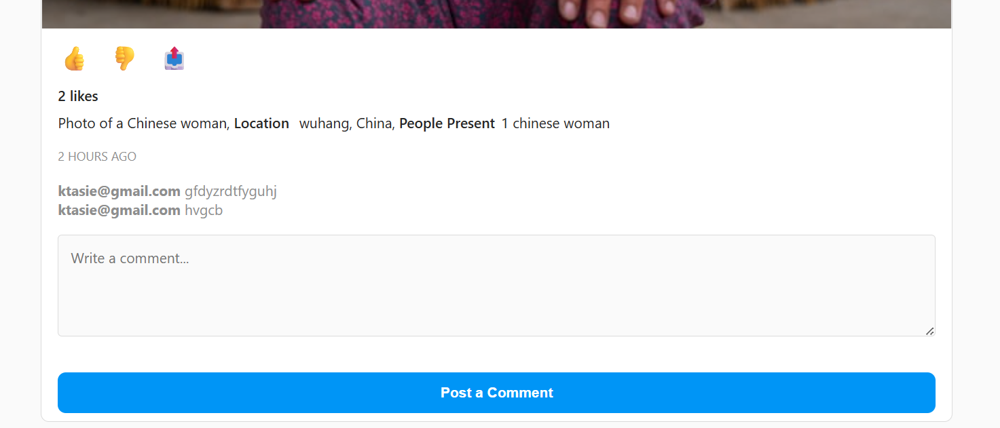
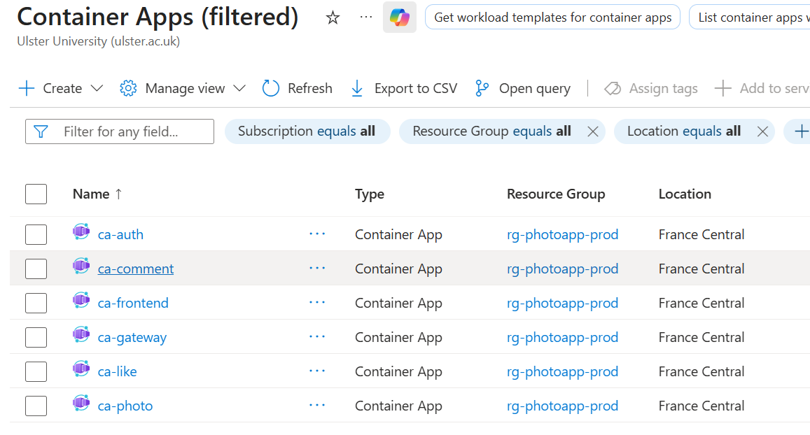
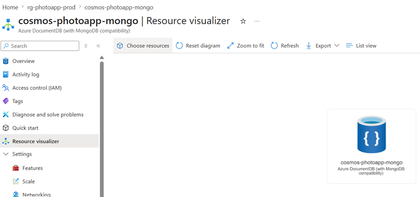
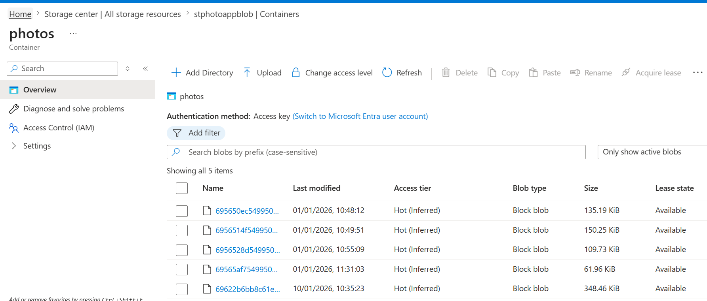
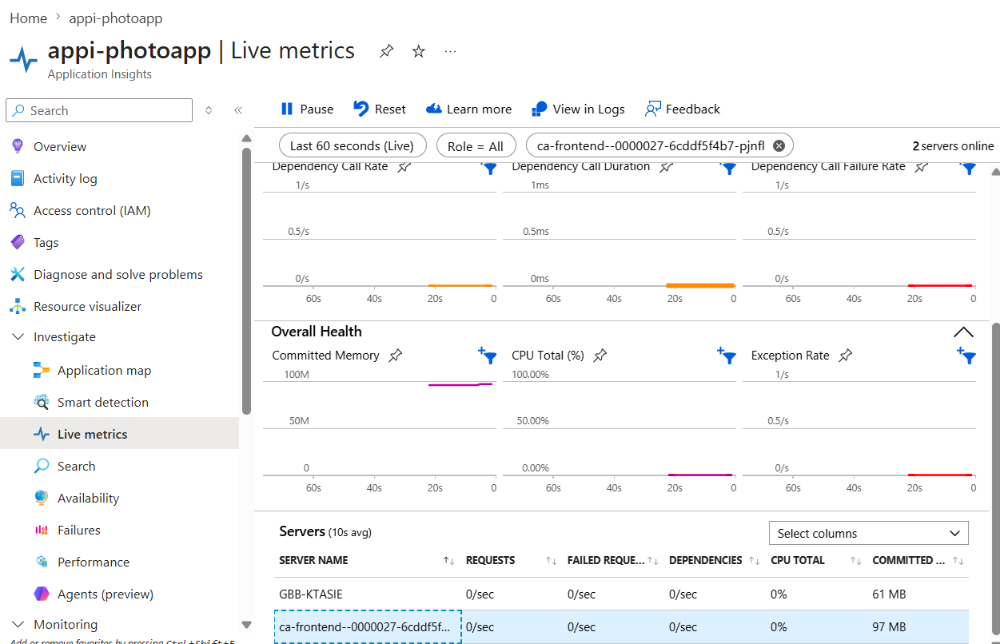
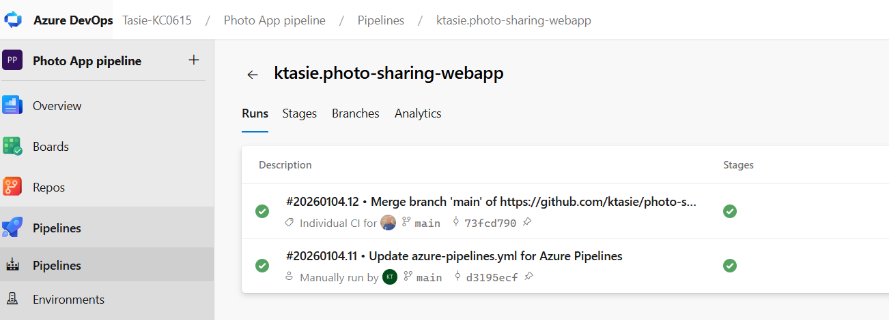

# Microservice Platform

A cloud-native microservice platform built with Node.js and deployed on Microsoft Azure. The project was developed to gain practical experience in distributed system design, service decomposition, cloud deployment, containerization, observability, and CI/CD automation.

The platform separates business functionality into independently deployable services, allowing individual components to be developed, deployed, monitored, and scaled independently.

---

## Overview

Traditional monolithic applications can become difficult to maintain and scale as functionality grows. This project explores how a microservice architecture can improve maintainability, fault isolation, deployment flexibility, and scalability by separating responsibilities into domain-specific services.

The platform implements a distributed backend architecture consisting of:

- Authentication Service
- Comment Service
- Like Service
- Upload Service
- API Gateway
- Frontend Application

Each service is packaged as a Docker container and deployed independently using Azure Container Apps.

---

## Architecture Diagram



_High-level overview of the microservice architecture deployed on Azure._

---

## Key Engineering Concepts Demonstrated

- Microservice Architecture
- API Gateway Pattern
- Stateless JWT Authentication
- Docker Containerization
- Azure Cloud Deployment
- Independent Service Scaling
- Blob-Based Media Storage
- CI/CD Automation
- Observability and Monitoring
- Distributed Backend Design

---

## Architecture

### High-Level Architecture

```text
                         ┌──────────────────┐
                         │     Frontend     │
                         └────────┬─────────┘
                                  │
                                  ▼
                         ┌──────────────────┐
                         │   API Gateway    │
                         └────────┬─────────┘
                                  │
      ┌──────────────┬────────────┼────────────┬
      ▼              ▼            ▼            ▼

┌──────────┐  ┌──────────┐ ┌──────────┐ ┌──────────┐
│   Auth   │  │ Comment  │ │   Like   │ │  Photo   │
│ Service  │  │ Service  │ │ Service  │ │ Service  │
└────┬─────┘  └────┬─────┘ └────┬─────┘ └────┬─────┘
     │             │            │            │
     └─────────────┴────────────┴────────────┘
                          │
            ┌─────────────┴─────────────┐
            ▼                           ▼

     ┌──────────────┐         ┌────────────────┐
     │ Azure Cosmos │         │ Azure Blob     │
     │ DB (MongoDB) │         │ Storage        │
     └──────────────┘         └────────────────┘
```

### Request Flow

```text
Client
   │
   ▼
Frontend
   │
   ▼
API Gateway
   │
   ├── Auth Service
   ├── Comment Service
   ├── Like Service
   └── Photo Service
```

The API Gateway acts as the single entry point into the backend and is responsible for request routing and JWT validation.

---

## Services

### Authentication Service

Responsible for user authentication and authorization.

**Features**

- User login
- JWT token generation
- Token validation
- Protected route access

---

### Comment Service

Handles user comments and engagement.

**Features**

- Create comments
- Retrieve comments

---

### Like Service

Manages user interaction metrics.

**Features**

- Like content
- Unlike content
- Engagement tracking

---

### Upload Service

Handles file upload and media management.

**Features**

- Upload media files
- File validation
- Metadata management
- Azure Blob Storage integration

---

### API Gateway

Central routing layer for backend services.

**Responsibilities**

- Request routing
- JWT verification
- Authentication enforcement
- Service forwarding

---

### Frontend

Server-rendered web application providing user interaction with backend services.

**Features**

- Authentication workflows
- Media uploads
- Comment management
- Content interaction
- Client-side content filtering

---

## Technology Stack

### Backend

- Node.js
- Express.js
- JSON Web Tokens (JWT)

### Database

- Azure Cosmos DB (MongoDB API)

### Storage

- Azure Blob Storage

### Infrastructure

- Docker
- Azure Container Apps

### Monitoring (Optional)

- Azure Application insights integration for frontend page views.

### DevOps

- Azure DevOps
- Docker Hub

---

## Repository Structure

```text
microservices-platform/
│
├── frontend/
├── gateway/
├── services
|   ├── auth-service/
|   ├── comment-service/
|   ├── like-service/
|   ├── photo-service/
│
├── assets/
│   └── screenshots/
│       ├── architecture-diagram.png
│       ├── login-page.png
│       ├── home-feed.png
│       ├── upload-page.png
│       ├── comment-page.png
│       ├── like-page.png
│       ├── azure-container-apps.png
│       ├── azure-cosmosdb.png
│       ├── azure-blob-storage.png
│       ├── azure-app-insights.png
│       └── azure-devops-pipeline.png
│
├── README.md
└── azure-pipelines.yml
```

---

## JWT Key Configuration

This application uses RS256 JWT signing and requirs RSA key pair.

Generate the keys:

```bash
openssl genpkey -algorithm RSA -out jwt_rsa -pkeyopt rsa_keygen_bits:2048
openssl rsa -pubout -in private.pem -out jwt_rsa.pub
```

Place the generated files in the configured key directories as per microservice:

```text
keys/
├── jwt_rsa
└── jwt_rsa.pub
```

The application loads these files at startup for JWT signing and verification.

> Important: Do not commit `jwt_rsa` to version control.

---

## Cloud Deployment

The platform is deployed on Microsoft Azure using a container-based architecture.

### Azure Services Used

| Service              | Purpose                         |
| -------------------- | ------------------------------- |
| Azure Container Apps | Hosting microservices           |
| Azure Cosmos DB      | Application data storage        |
| Azure Blob Storage   | Media storage                   |
| Docker Hub           | Container image registry        |
| Azure Log Analytics  | Monitoring and diagnostics      |
| Azure DevOps         | Build and deployment automation |

### Deployment Characteristics

- Independent service deployment
- Containerized workloads
- Stateless authentication
- Multi-replica deployment
- Fault isolation between services
- Cloud-managed storage

---

## Scalability Design

The system was designed with scalability in mind.

### Implemented Approaches

- Stateless JWT authentication
- Independent microservices
- Containerized deployments
- Replica-based scaling
- Externalized media storage
- Decoupled business domains

### Benefits

- Reduced coupling
- Easier maintenance
- Independent deployments
- Improved fault isolation
- Better scalability potential

---

## Screenshots

### Login & Authentication



_JWT-based authentication workflow._

---

### Home Feed



_Main application interface displaying uploaded content._

---

### Upload Functionality



_Media upload workflow integrated with Azure Blob Storage._

---

### Comment and Like Functionality



_Users can comment and Like through the Comment Service and Like Service._

---

## Azure Deployment Screenshots

### Azure Container Apps



_Independent deployment of microservices using Azure Container Apps._

---

### Azure Cosmos DB



_Application metadata and user information stored in Azure Cosmos DB._

---

### Azure Blob Storage



_Cloud storage for uploaded media assets._

---

### Azure App Insights



_Application Insights integration._

---

### Azure DevOps Pipeline



_Build and deployment automation workflow._

---

## Local Development

### Prerequisites

- Node.js
- MongoDB
- Docker
- Azurite (Azure Storage Emulator)

### Clone Repository

```bash
git clone https://github.com/ktasie/microservices-platform.git
cd microservices-platform
```

### Install Dependencies

Run for each service:

```bash
npm install
```

### Start Local Infrastructure

Start MongoDB and Azurite.

### Run Services

```bash
npm run start
```

or

```bash
node app.js
```

Each microservice must be started independently.

---

## CI/CD

Azure DevOps was used to support deployment automation and improve release consistency.

The deployment workflow includes:

- Source control integration
- Container image builds
- Docker Hub publishing
- Azure deployment support

This reduces manual deployment effort and provides a repeatable deployment process.

---

## Monitoring & Observability

Operational visibility is provided through Azure Log Analytics.

Monitored metrics include:

- Application logs
- Error diagnostics
- Request monitoring
- Service health information

This enables troubleshooting and operational monitoring after deployment.

---

## Current Limitations

The project was primarily designed as a learning platform for distributed systems and cloud-native deployment.

Current limitations include:

- No automated unit tests
- No automated integration tests
- Limited request validation
- Single-region deployment
- Synchronous HTTP communication between services
- Client-side filtering instead of dedicated search infrastructure
- Limited production-grade monitoring and tracing

---

## Future Improvements

Potential future enhancements include:

- Comprehensive unit and integration testing
- Distributed tracing
- Event-driven communication
- Message queue integration
- Redis caching
- Azure Front Door integration
- Web Application Firewall (WAF)
- Multi-region deployment
- Advanced search functionality
- Enhanced monitoring dashboards

---

## Learning Outcomes

This project provided hands-on experience with:

- Designing distributed systems
- Building microservices
- Cloud-native application deployment
- Docker containerization
- Azure infrastructure services
- JWT authentication and authorization
- CI/CD practices
- Observability and monitoring
- Scalability considerations in modern backend systems

The platform serves as a practical demonstration of how modern cloud applications can be decomposed into independently deployable services while maintaining scalability and operational flexibility.

---

## Author

**Kelechukwu Tasie**

Project Repository: https://github.com/ktasie/microservices-platform
